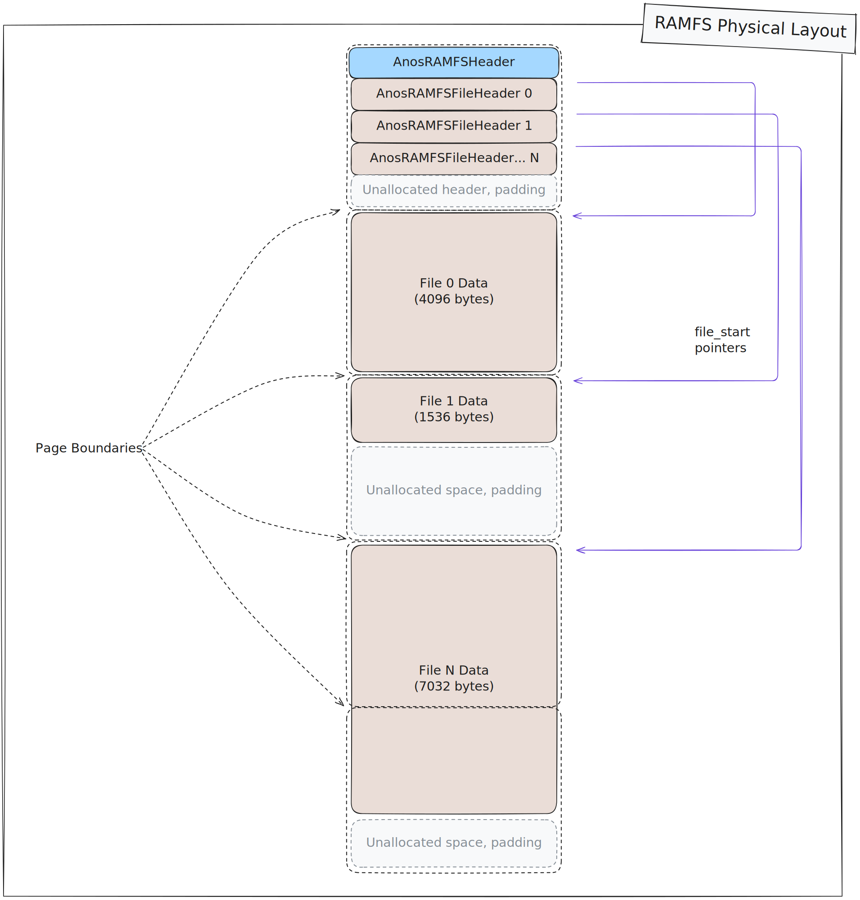

# Kernel Internals

> [!NOTE]
> This documentation is under construction, and is evolving with the kernel
> itself. Only things that are somewhat solidified are documented here, 
> and any information is subject to change as the design and implementation
> progresses.

## Kernel Boot Flow

This diagram shows the general code flow for the kernel boot and initialisation
process on x86_64. 

## RAMFS Physical Layout

This diagram shows the physical layout of RAMFS file systems in memory.

