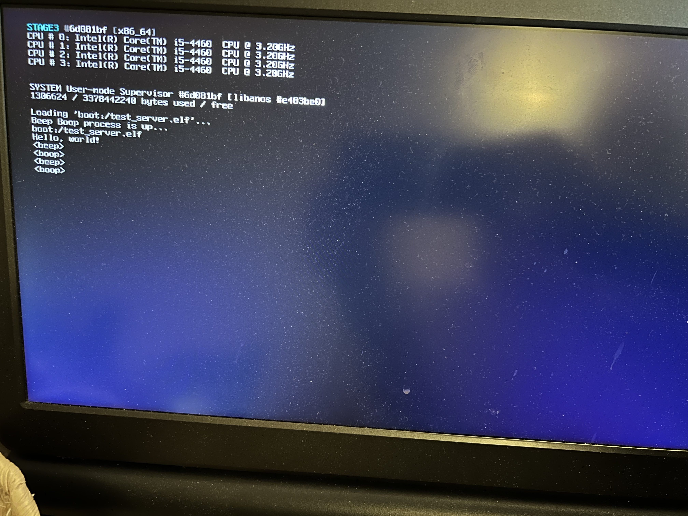

## anos - An Operating System 💾


> [!NOTE]
> This is not yet an operating system, but _definitely has_  reached 
> "toy kernel" status, since it now supports user mode preemptive 
> multitasking on up to 16 CPUs & runs on real hardware 🥳.

### High-level overview

> **Note** this is still evolving!

Anos is a modern, opinionated, non-POSIX operating system
(just a hobby, won't be big and professional like GNU-Linux®) 
for x86_64 PCs and RISC-V machines.

It is free software licensed under the GPLv2, with similar
linkage exceptions as other major free operating systems.

#### TL;DR / Headline features

* Non-zealous microkernel (`"STAGE3"`) with scheduling, memory management, and IPC primitives
* Strict system-wide capability-based security model
* User-space system management server (`"SYSTEM"`) provides common OS abstractions
* User-space ACPI or Devicetree-based hardware discovery and driver model (WIP)
* Custom software-development toolchain (based on binutils, GCC and Newlib)
* Requirements (theoretical min/max): 1 core, 256MiB RAM / 16 cores, 127TiB RAM 

#### Kernel Design (WIP, subject to change)

As far as the Kernel is concerned, there's much to still be decided,
and most of what has been decided could still change without notice.

Since this is being designed as 64-bit from the beginning, there's
a lot of things I can do that I wouldn't otherwise be able to, and
I'm experimenting with a few different ideas. Decisions I've taken so
far are, briefly:

* Non-zealous microkernel providing _only_:
  * **Bare-minimum drivers for hardware used in the kernel itself**
    * **CPU**
    * **HPET**
    * **LAPIC**
    * **Legacy serial (debug/test builds only)**
  * **Physical / virtual memory management**
  * **Thread / Process management & address space primitives**
  * **Scheduling (and directly-related concurrency primitives)**
  * **IPC** (_just a single primitive mechanism, still WIP_)
  * Small, targeted syscall interface (_started, still WIP_)
    * **Fast channel (via `SYSCALL` and `SYSRET`)**
    * **Slow channel (via `int 0x69`)**
  * **Delegatable capability-based syscall control**
* ***User-mode SYSTEM supervisor providing operating-system services**
  * **Basic userspace bootstrap**
  * **VFS**
* SYSTEM coordinates activities of other services to provide:
  * Hardware drivers (via capability-based MMIO)
  * Networking
  * GUI
  * etc.
* _Limited / no legacy support - x86_64 required, no PIC / PIT etc,_
* _Minimum "supported" architecture: Haswell (4th gen)_

(Items in **bold** are already implemented, for some value of the term.
If you want more detail they are, as far as possible, documented in the 
source / comments).

The basic idea is most user processes will have _very_ limited syscall
capability - and instead will use (hopefully) fast IPC to request 
services from the user-mode supervisor and directly from other services.

The supervisor itself is endowed with all capabilities, and will 
be responsible for delegating said capabilities appropriately to other
processes as they are started and depending on their requirements and trust
level.

Processes exist in a hierarchy, with processes that have the 
capability to start other process further be able to delegate capabilities
_they_ hold to other processes they supervise.

#### Current State

Things are developing quite nicely, if I do say so myself.

We have enough support for everything (page fault handling,
IDT, virtual memory management, etc) to be able to get to a 
multitasking user mode and then back via a simple syscall interface
(accessible via both `int` and `syscall` interfaces).

Scheduling is currently handled by a simple prioritised round-robin 
scheduler with four priority classes and 255 priority levels per
class. The design is currently simple and rather suboptimal, and 
there are significant opportunities for improvement in this area.

SMP is supported, up to a maximum of 16 symmetric cores (one BSP
and 15 APs) - although anything over 8 cores will be unstable 
right now as I haven't made the switch to x2APIC. 

The scheduler operates on a per-CPU basis and is driven by each CPU's
independent local APIC timer. The plan is to migrate this to a tickless
design in the near future in order to improve power efficiency
in the final design.

> [!NOTE]
> Realtime scheduling is, like realtime behaviour in general, a non-goal 
> of this project.

There's a (_very much WIP_) custom toolchain, based on binutils,
GCC (15) and with Newlib providing libc (with Anos-specifics handled
by a custom `libgloss` implementation). 

You can find the toolchain, along with build instructions,
[here](https://github.com/roscopeco/anos-toolchain).

> [!NOTE]
> The toolchain is currently x86_64 only. There will be a RISC-V
> port in the fullness of time, but currently the kernel port for
> that architecture isn't advanced enough to make it anywhere near
> user mode, so it's not needed yet - a `riscv64-elf-` toolchain
> is good enough for building on that architecture.

### Building

#### x86_64

Everything is built with `make`. The 
[anos toolchain](https://github.com/roscopeco/anos-toolchain) 
is **required**. Ensure you download, build and install the 
toolchain (follow the instructions in the README over there)
and that it's available somewhere in your path.

All assembly code is built with NASM. 2.16 or higher is recommended.

For running and debugging, you'll want `qemu-system-x86_64`. 
Bochs is also supported if you prefer (there's a minimal `bochsrc`
in the repo that will get you going).

To build the FAT filesystem for the UEFI disk image, `mtools` is
needed, specifically `mformat`, `mcopy` - but I don't know if 
you can get just those, and it's best to get the whole suite
anyway as it can be useful for debugging things.

You'll need a sane build environment (i.e. a UNIX) with `make` 
etc. FWIW I work on macOS, YMMV on Linux or WSL (but I expect
it should work fine - for Linux at least we have CI runners
on every build).

There are probably some test programs and helpers that I use 
in the repo (e.g. `fat.c`). These will need a native Clang or GCC
toolchain - again, sane build environment recommended... 😜

To build, just do:

```shell
make clean all
```

This will do the following:

* Run a bunch of unit tests (and stop if they fail)
* Build the `STAGE3` kernel
* Build the `SYSTEM` user-mode supervisor and test servers
* Link the kernel and initial RAMFS into a single ELF64 
* Create a disassembly file (`.dis`)
* Build a UEFI-bootable FAT floppy with the OS

You can also choose to just run `make test` if you only want to
run the tests, or `make build` if you just want the image. If 
you have an appropriate `qemu` installed, you can also run
e.g. `make qemu-uefi` - see the `Running` section below for
more details (including GDB debugging options).

If you have `LCOV` installed, you can also generate coverage
reports with `make coverage` - these will be output in
the `gcov/kernel` directory as HTML.

#### RISC-V

> [!WARNING]
> RISC-V support is _very_ much in its infancy right now - there's
> enough to get through early boot and start the PMM and VMM, 
> including setting up a direct map but that's it.
> 
> I'm targeting the DeepComputing Framework mainboard currently, 
> but at time of writing the RISC-V port has only run in emulators 
> and has some weird requirements that need to be overcome before 
> real hardware is a thing. It has basically zero features beyond
> booting and printing. It doesn't even get nearly far enough to 
> start additional harts.
>
> Unless you're hacking on it, stick with x86_64 for now.

Currently, we have no custom toolchain, but one isn't needed
since the RISC-V port is far away from booting to SYSTEM 
right now.

You'll want to have the `riscv64-elf-` binutils and GCC toolchains
installed. Then run:

```shell
ARCH=riscv64 make clean qemu-uefi
```

You'll obviously also need `qemu-system-riscv64` installed.

### Running

#### In an emulator

Qemu is the emulator of choice, and the only one we test on.
YMMV may vary on other emulators (and if you hit issues with
them, we _may_ accept PRs but _will not_ accept bug reports 🙂).

You must use a qemu that supports UEFI. Everything you need (except
qemu-system-x86_64 itself) should be in the repo. Assuming qemu is
installed, you should just need to do:

To run in qemu:

```shell
make qemu-uefi
```

#### On real hardware

If you want to run this on real hardware, you'll need something
that can burn bootable USB sticks.

[balenaEtcher](https://etcher.balena.io) does the job nicely, and
[UNetbootin](https://unetbootin.github.io) will work (but is not
a great piece of software generally, so YMMV).

Once you have suitable software, you should be able to use it
to flash `anos-uefi.img` to a USB stick or other bootable medium.

Full disclosure: so far, this has been tested on exactly one real
machine, a random Haswell i5 I bought specifically for the purpose
from a thrift store. It works well on that machine, but that doesn't
mean it'll work on your machine necessarily.

### Debugging

> [!WARNING]
> If you're debugging, it's **strongly** recommended that you build
> without optimisation, or your debugging experience will likely be....
> _interesting_.
> 
> To achieve this, pass `OPTIMIZE=0` at the beginning of your `make`
> command, e.g. `OPTIMIZE=0 make clean debug-qemu-uefi`.

The recommended way to debug is with qemu's built-in GDB remote stub.
qemu _does_ have some built-in debugging commands, but full-fat GDB is
pretty hard to beat, and it works well with qemu.

For convenience, a `.gdbinit` file is provided that will automate
loading the symbols and connecting to qemu. This can be easily
kicked off with:

```shell
make debug-qemu-uefi
```

This will build what needs to be built, start qemu with debugging,
and launch GDB automatically.

> **Note** You'll want NASM 2.16 or higher if you have a modern
> GDB (13 and up) - I've observed issues with loading DWARF data
> generated by NASM 2.15, which causes symbol clashes and sources 
> not to be loaded.

Because symbols and sources are loaded, you can set breakpoints 
easily based on labels or line numbers, e.g:

```gdb
b entrypoint.c:bsp_kernel_entrypoint
b startup.c:35
```

If you prefer to use debugging in an IDE or have some other alternative
GDB frontend you like to use, you can just run:

```shell
make debug-qemu-uefi-start
```

which will skip starting GDB for you, allowing you to launch 
your frontend and connect (target remote `localhost:9666` by 
default).

#### Debugging in CLion

If you're using CLion, you can easily set up a "Remote debugging" run configuration
like this to allow you to connect to a running qemu in debug mode.


You can use the "before launch" options to set things up to automatically 
run `make debug-qemu-uefi-start`, but I've found this problematic - if
you find the same it's easy enough to just run that command (remembering
to supply `OPTIMIZE=0`) from the terminal then hit the bug button to connect.

#### Debugging in VSCode

If Visual Studio Code is your bag, you should be able to debug visually using that,
there are `launch.json` and `tasks.json` files included that seem to work on 
my machine. 

You'll probably need the "Native Debugging" extension installed from the marketplace,
the standard one seems to be unusually braindead, even by Visual Studio standards.

Once you have that, stick a breakpoint in the margin somewhere and then run the 
`(gdb) Attach` configuration from the debug tab. It should build the project,
kick off qemu and then connect to it allowing you to debug things.

> **Note**: Certain things don't work well, I'd still go with `gdb` terminal if
> you're comfortable with it. The stack doesn't get populated correctly in vscode,
> for example - though it _does_ use the symbols we give it so it can at least find
> the appropriate line of code in both C and assembly source, so it's _basicaly usable_.

### Developing

If you're developing the code, you'll want to have
[clang-format](https://clang.llvm.org/docs/ClangFormat.html) installed for code formatting.

If you're committing to git, we use [pre-commit](https://pre-commit.com) to manage 
pre-commit hooks that handle formatting automatically on commit.

```bash
pip install pre-commit
pre-commit install
```

### Status & Pics

#### On x86_64

> [!NOTE]
> These probably aren't up to date enough to represent where it's 
> at _today_, but it should be relatively recent.

Anos now runs on real hardware (with a sample size of exactly one) and
supports UEFI boot (with the Limine bootloader).

Here, it's running on an old i5 4th-gen (Haswell) with 16GiB RAM. Haswell
is the oldest architecture that Anos "officially" supports.

It's running two processes (The SYSTEM user-mode supervisor, and a simple
test server loaded from RAM disk via IPC messaging with SYSTEM) with multiple
threads on the different cores.

All the basics of running programs is tested here - new process setup, 
loading ELF binaries from the VFS via the SYSTEM IPC interface,
capability delegation (Kernel -> SYSTEM -> test server), environment
setup and argument passing etc. You can read more about that whole
thing in the [docs](docs/Processes.md).

All code is built with the new
[Anos newlib toolchain](https://github.com/roscopeco/anos-toolchain), with SYSTEM and server code compiled
in hosted mode (i.e. without `-ffreestanding` etc).



It also runs in emulators, of course - here's Qemu booted via UEFI, using the
graphical debug terminal at 1280x800 resolution and again showing the 
experimental IPC features:


Broadly, this is happening here:

* Boot
  * With our BIOS bootloader - fully boot from real to long mode
  * With Limine (UEFI) - Take over from Limine and set everything up for Kernel
* Set up our graphical terminal (or text-mode if non-UEFI)
* Set up a RLE stack-based PMM
* Set up VMM & direct-mapped paging
* Set up fixed block & slab allocators
* _Just enough_ ACPI to initialise basic platform devices (HPET & LAPICs)
* Init LAPICs and calibrate with HPET
* Initialise inter-processor work queues and set up IPIs 
* Set everything up for usermode startup
* Start a prioritised round-robin scheduler on all CPUs
* User-mode supervisor ("`SYSTEM`") starts some threads with a `syscall`
* Supervisor also creates a new process with another `syscall`
* New process sets up its own execution environment
  * Uses IPC messaging to request system load its (ELF) binary from RAMFS
  * Sets up capabilities delegated to it from SYSTEM
  * Sets up its own user-space memory using `syscall`s to the kernel
  * Uses a GCC static constructor (just as a test) to print a "loaded" message
  * Prints out `argc` passed to it by SYSTEM
  * Goes into a "beep/boop" loop, calling back to the kernel to sleep between messages.

The following things are not shown in this shot, but are still happening under the hood:

* Enumerate PCI bus (including bridges)

#### On RISC-V

Currently, RISC-V support is untested on real hardware, but known not-working 
except on some _seriously weird_ dev board that doesn't exist - with VGA etc.

It's also early days for the port, so we don't get very far - but it **does**
boot on `qemu-system-riscv64`:

* Boot
  * With Limine (UEFI) - Take over from Limine and set everything up for Kernel
* Set up our graphical terminal (or text-mode if non-UEFI)
* Set up a RLE stack-based PMM
* Set up VMM & direct-mapped paging
* Do some tests of memory allocation and mapping
* Initialise enough to be able to `panic` and print a message inviting you to 
  help with the RISC-V port! ;)


