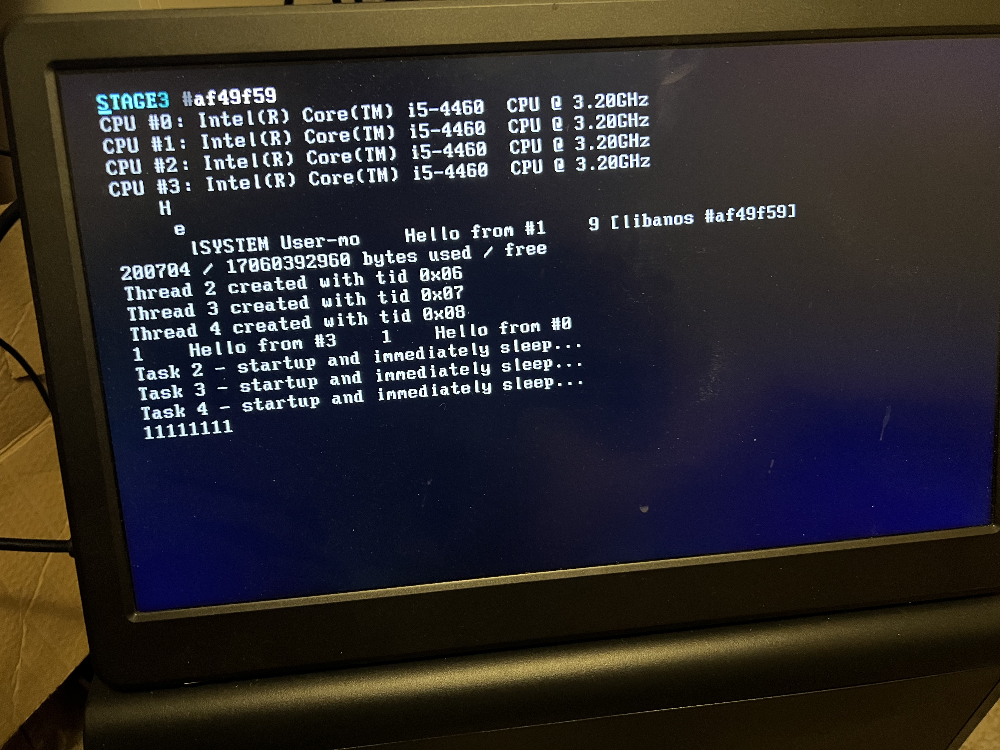

## anos - An Operating System 💾


> [!NOTE]
> This is not yet an operating system, but _definitely has_  reached 
> "toy kernel" status, since it now supports user mode preemptive 
> multitasking on up to 16 CPUs & runs on real hardware 🥳.

### High-level overview

> **Note** this is still evolving!

Right now, there's two boot options - a hand-rolled two-stage BIOS bootloader
(I know there are existing,better options, but one of my goals was to figure
legacy bootloaders out), and modern UEFI boot (using the Limine boot protocol).

The legacy BIOS loaded will load from FAT floppy (and only floppy - no hard-disk
support yet). UEFI is from FAT also, as usual, with the appropriate layout of
files on the partition.

#### Legacy Bootloader

The bootloader does enough basic set up to load a (flat binary, ELF might
be supported eventually) kernel at 0x120000 (physical), set up long mode
with initial (super basic) paging, and call that kernel at 
0xFFFFFFFF80120000 (virtual, mapped to the physical load address).

The loader also fetches a BIOS memory map before leaving (un)real mode
forever, and passes that map (unprocessed, currently) to the kernel via a 
pointer parameter.

The loader **does not** do any BSS clearing or other C set-up - the kernel
has a small assembly stub that just zeroes out that segment and passes
control. No (C++, or C with GCC extensions) static constructors or anything
else are run at the moment - this is not a complete C environment :D

Also worth noting that the loader doesn't do **anything** at all with 
interrupt vectors - that's totally up to the kernel (and interrupts are
left disabled throughout the load and remain so on kernel entry).

#### Kernel Design (WIP, subject to change)

As far as the Kernel is concerned, there's much to still be decided,
and most of what has been decided could still change without notice.

Since this is being designed as 64-bit from the beginning, there's
a lot of things I can do that I wouldn't otherwise be able to, and
I'm experimenting with a few different ideas. Decisions I've taken so
far are, briefly:

* Non-zealous microkernel providing _only_:
  * **Bare-minimum drivers for hardware used in the kernel itself**
    * **CPU**
    * **HPET**
    * **LAPIC**
    * **Legacy serial (debug/test builds only)**
  * **Physical / virtual memory management**
  * **Thread / Process management & address space primitives**
  * **Scheduling (and directly-related concurrency primitives)**
  * **IPC** (_just a single primitive mechanism, still WIP_)
  * Small, targeted syscall interface (_started, still WIP_)
    * **Fast channel (via `SYSCALL` and `SYSRET`)**
    * **Slow channel (via `int 0x69`)**
  * Delegatable capability-based syscall control
* User-mode SYSTEM supervisor providing operating-system services
  * **Basic userspace bootstrap**
  * VFS
* SYSTEM coordinates activities of other services to provide:
  * Hardware drivers (via capability-based MMIO)
  * Networking
  * GUI
  * etc.
* Limited / no legacy support - x86_64 required, no PIC / PIT etc,
* Minimum "supported" architecture: Haswell (4th gen)

(Items in **bold** are already implemented, for some value of the term.
If you want more detail they are, as far as possible, documented in the 
source / comments).

The basic idea is most user processes will have _very_ limited syscall
capability - and instead will use (hopefully) fast IPC to request 
services from the user-mode supervisor and directly from other services.

The supervisor itself will be endowed with all capabilities, and will 
be responsible for delegating said capabilities appropriately to other
processes as they are started and depending on their requirements and trust
level.

Processes will exist in a hierarchy, with processes that have the 
capability to start other process further be able to delegate capabilities
_they_ hold to other processes they supervise.

#### Current State

Things are developing quite nicely, if I do say so myself.

We have enough support for everything (page fault handling,
IDT, virtual memory management, etc) to be able to get to a 
multitasking user mode and then back via a simple syscall interface
(accessible via both `int` and `syscall` interfaces).

Scheduling is currently handled by a simple prioritised round-robin 
scheduler with four priority classes and 255 priority levels per
class. The design is currently simple and rather suboptimal, and 
there are significant opportunities for improvement in this area.

SMP is supported, up to a maximum of 16 symmetric cores (one BSP
and 15 APs). The scheduler operates on a per-CPU basis and is driven by
each CPUs independent local APIC timer. The plan is to migrate this to
a tickless design in the near future in order to improve power efficiency
in the final design.

Realtime scheduling is, like realtime behaviour in general, a non-goal 
of this project.

### Building

#### x86_64

Everything is built with `make`. The 
[anos toolchain](https://github.com/roscopeco/anos-toolchain) 
is **required**. Ensure you download, build and install the 
toolchain (follow the instructions in the README over there)
and that it's available somewhere in your path.

All assembly code is built with NASM. 2.16 or higher is recommended.

For running and debugging, you'll want `qemu-system-x86_64`. 
Bochs is also supported if you prefer (there's a minimal `bochsrc`
in the repo that will get you going).

To build the FAT filesystem for the floppy image, `mtools` is
needed, specifically `mformat`, `mcopy` - but I don't know if 
you can get just those, and it's best to get the whole suite
anyway as it can be useful for debugging things.

You'll need a sane build environment (i.e. a UNIX) with `make` 
etc. FWIW I work on macOS, YMMV on Linux or WSL (but I expect
it should work fine).

There are probably some test programs and helpers that I use 
in the repo (e.g. `fat.c`). These will need a native Clang or GCC
toolchain - again, sane build environment recommended... 😜

To build, just do:

```shell
make clean all
```

This will do the following:

* Build kernel ELF
* Build the `System` user-mode supervisor and test servers
* Create a disassembly file (`.dis`)
* Build a floppy-disk image with the (stripped) kernel and System
* Run a bunch of unit tests

You can also choose to just run `make test` if you want to run the
tests. If you have `LCOV` installed, you can also generate 
coverage reports with `make coverage` - these will be output in
the `gcov/kernel` directory as HTML.

#### RISC-V

> [!WARNING]
> RISC-V support is _very_ much in its infancy right now - it's 
> basically the scaffolding and enough code to boot into C from
> limine, and that's all.
>
> It only works on a qemu that's setup weirdly (e.g. with VGA)
> and will not work on any real hardware at all yet. It also 
> has basically zero features beyond booting and printing. It
> doesn't even set up paging or start additional harts.
>
> Unless you're hacking on it, stick with x86_64 for now.

Currently, we have no custom toolchain, but one isn't needed
since the RISC-V port is far away from booting to SYSTEM 
right now.

You'll want to have the `riscv64-elf-` binutils and GCC toolchains
installed. Then run:

```shell
ARCH=riscv64 make clean qemu-uefi
```

You'll obviously also need `qemu-system-riscv64` installed.

### Running

#### In an emulator

You can use either qemu or Bochs. Obviously you'll need them
installed.

> [!NOTE]
> If you're on Mac and want to use Bochs, it's best to 
> build your own from source. The one in brew is kinda broken, 
> in that the display doesn't always work right and the debugger
> has bad keyboard support (no history etc).

The recommended way now is to use UEFI. Everything you need (except
qemu-system-x86_64 itself) should be in the repo. Assuming qemu is
installed, you should just need to do:

To run in qemu:

```shell
make qemu-uefi
```

Or, if you want to run the BIOS version:

```shell
LEGACY_TERMINAL=true make qemu
```

Or Bochs (you may need to manually build the terminal with the 
legacy `LEGACY_TERMINAL=true` option for this to work):

```shell
make bochs
```

This latter one is really just running `bochs` directly, but will
also handle building the code and floppy image automatically for 
you. Of course, you can just run `bochs` directly yourself if 
you like - I'm not one to judge.

#### VirtualBox

You _can_ use Virtualbox (and it's faster than e.g. qemu). There's
a machine setup in the repo that might work for it.

So far, I've not been able to get the UEFI boot working - only 
BIOS for Virtualbox right now.

#### On real hardware

If you want to run this on real hardware, you'll need something
that will either write the `img` file to a floppy as raw sectors,
or something that can burn bootable USB sticks.
[balenaEtcher](https://etcher.balena.io) does the job nicely, and
[UNetbootin](https://unetbootin.github.io) will work (but is not
a great piece of software generally, so YMMV).

Full disclosure: so far, this has been tested on exactly one real
machine, a random Haswell i5 I bought specifically for the purpose
from a thrift store. It works well on that machine, but that doesn't
mean it'll work on your machine necessarily.

The main problem I forsee on newer machines is that they probably
won't emulate legacy BIOS (with a CSM). 

If you want to run the legacy BIOS build on newer machines, you 
might need to go into the BIOS settings (assuming that's still 
a thing) and set them up to boot from floppy and use legacy BIOS.

However, with UEFI support now mainlined, it's recommended to 
always use that on real hardware anyway.

### Debugging

The recommended way to debug is with qemu. Bochs _is_ still supported,
and the debugger built into it isn't _bad_, but full-fat GDB is pretty
hard to beat and it works well with qemu.

For convenience, a `.gdbinit` file is provided that will automate
loading the symbols and connecting to qemu. This can be easily
kicked off with:

```shell
make debug-qemu-uefi
```

Or, if you want to debug the legacy BIOS loader (or kernel built for
it) you can do:

```shell
LEGACY_TERMINAL=true make debug-qemu
```

This will build what needs to be built, start qemu with debugging,
and launch GDB automatically.

> **Note** You'll want NASM 2.16 or higher if you have a modern
> GDB (13 and up) - I've observed issues with loading DWARF data
> generated by NASM 2.15, which causes symbol clashes and sources 
> not to be loaded.

Because symbols and sources are loaded, you can set breakpoints 
easily based on labels or line numbers, e.g:

```gdb
b entrypoint.c:bsp_kernel_entrypoint
b startup.c:35
```

If you prefer to use debugging in an IDE or have some other alternative
GDB frontend you like to use, you can just run:

```shell
make debug-qemu-start
```

which will skip starting GDB for you, allowing you to launch 
your frontend and connect (`localhost:9666` by default).

If you're debugging the legacy loader, it's worth noting that 
we no longer load the symbol files by default - you'll need to
do e.g:

```
add-symbol-file stage1/stage1.elf
add-symbol-file stage2/stage2.elf
```

if you want them. They are still in the `.gdbinit`, just commented
out, so if you find yourself doing this a lot, just uncomment those.

#### Debugging in VSCode

If Visual Studio Code is your bag, you should be able to debug visually using that,
there are `launch.json` and `tasks.json` files included that seem to work on 
my machine. 

You'll probably need the "Native Debugging" extension installed from the marketplace,
the standard one seems to be unusually braindead, even by Visual Studio standards.

Once you have that, stick a breakpoint in the margin somewhere and then run the 
`(gdb) Attach` configuration from the debug tab. It should build the project,
kick off qemu and then connect to it allowing you to debug things.

> **Note**: Certain things don't work well, I'd still go with `gdb` terminal if
> you're comfortable with it. The stack doesn't get populated correctly in vscode,
> for example - though it _does_ use the symbols we give it so it can at least find
> the appropriate line of code in both C and assembly source, so it's _basicaly usable_.

### Developing

If you're developing the code, you'll want to have
[clang-format](https://clang.llvm.org/docs/ClangFormat.html) installed for code formatting.

If you're committing to git, we use [pre-commit](https://pre-commit.com) to manage 
pre-commit hooks that handle formatting automatically on commit.

```bash
pip install pre-commit
pre-commit install
```

### Status & Pics

> [!NOTE]
> These probably aren't up to date enough to represent where it's 
> at _today_, but it should be relatively recent.

Anos now runs on real hardware (with a sample size of exactly one) and
supports UEFI boot (with the Limine bootloader).

Here, it's running on an old i5 4th-gen (Haswell) with 16GiB RAM. Haswell
is the oldest architecture that Anos "officially" supports.

It's running two processes (The SYSTEM user-mode supervisor, and a simple
test server loaded from RAM disk via IPC messaging with SYSTEM) with multiple
threads on the different cores.

The test server is built with the new
[Anos newlib toolchain](https://github.com/roscopeco/anos-toolchain).


And the same computer, but booted with legacy BIOS boot (and VGA text mode).
It's worth noting this image is running an older kernel so doesn't have all
the same features as the one above:



It also runs in emulators, of course - here's Qemu booted via UEFI, using the
graphical debug terminal at 1280x800 resolution and again showing the 
experimental IPC features:


Or legacy BIOS boot in VirtualBox, just for a change from qemu. Again, this
is an older kernel.


Broadly, this is happening here:

* Boot
  * With our BIOS bootloader - fully boot from real to long mode
  * With Limine (UEFI) - Take over from Limine and set everything up for Kernel  
* Set up a RLE stack-based PMM
* Set up VMM & recursive paging (for now, will likely change later)
* Set up fixed block & slab allocators
* _Just enough_ ACPI to initialise basic platform devices (HPET & LAPICs)
* Init LAPICs and calibrate with HPET
* Set everything up for usermode startup
* Start a prioritised round-robin scheduler on all CPUs
* User-mode supervisor ("`SYSTEM`") starts some threads with a `syscall`
* Supervisor also creates a new process with another `syscall`
* New process sets up its own execution environment
  * Uses IPC messaging to request system load its binary from RAMFS
  * Sets up its own memory using `syscall`s to the kernel
  * Uses a GCC static constructor (just as a test) to print a "loaded" message
  * Goes into a "beep/boop" loop, calling back to the kernel to sleep between messages.

The following things are not shown in this shot, but are still happening under the hood:

* Enumerate PCI bus (including bridges)
